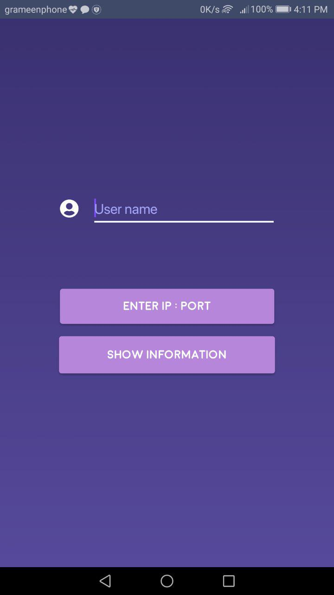
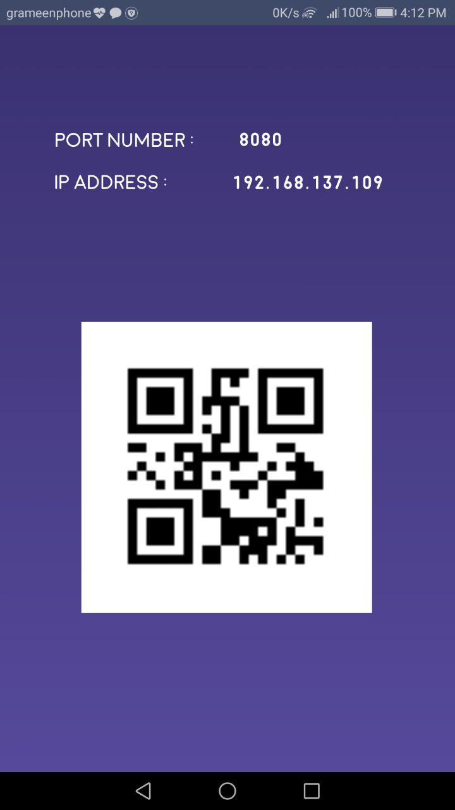
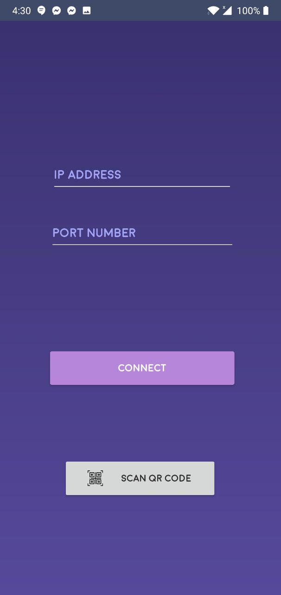
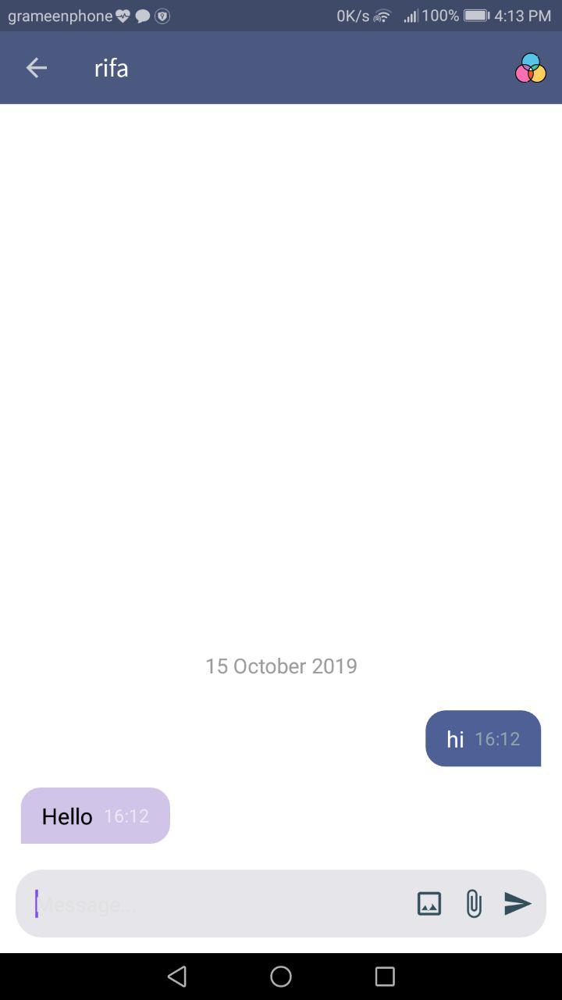
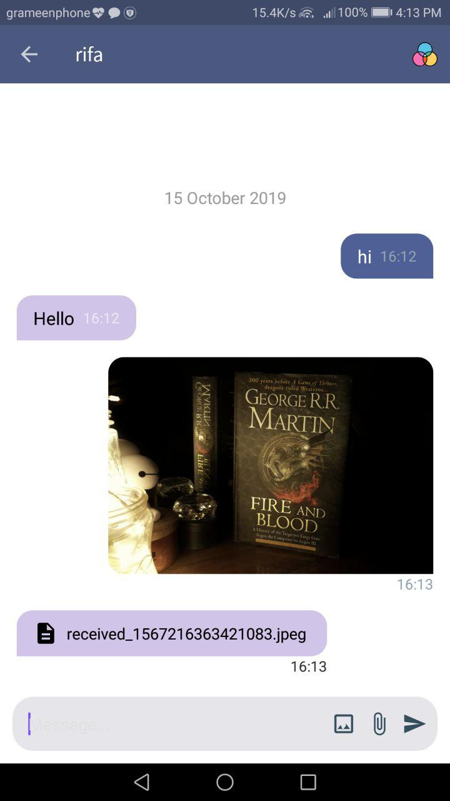
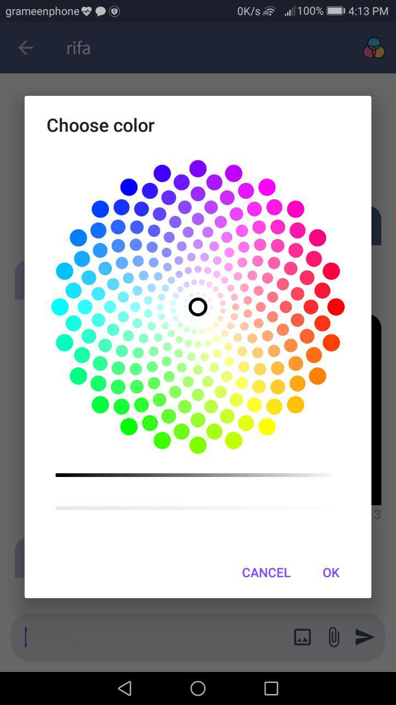
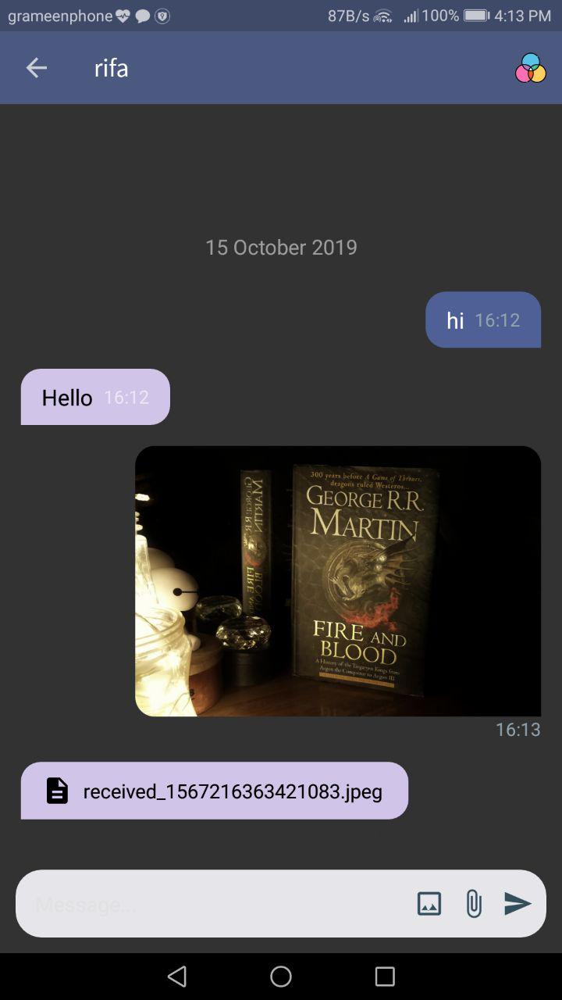
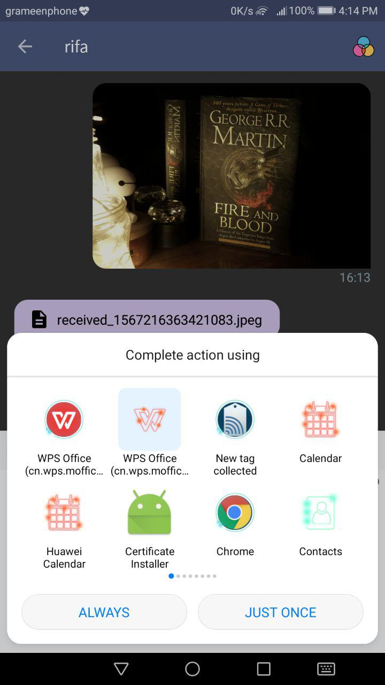

# Android P2P Chat Application using JAVA Socket

This is a chat application which allows text messaging and files sharing using JAVA Socket

## Features

 - Text messaging 

 - File sharing (any type)

 - Image sharing

 - Connect using QR Code Scanner

 - Set background color dynamically with custom color picker

 - Show image thumbnail in chat

 - Download shared files and images in your local device

## Demo
   

  

 

## Instructions

  1. First Connect both the devices to same wifi network.
  
  2. Set username. <strong>Username is CASE-SENSITIVE</strong>.
  
  3. Click the "Show Information" button in one device.
  
  4. Click "Enter IP:Port" button in another device.
  
  5. Scan The QR Code & click connect button.
  
  6. Or enter ip address and port number manually.
  
  7. Start messaging.
  
  8. To download any shared file or image, long press over the thumbnail , the file/image will be downloaded and will show notification in notificatin bar of the device to open with external software.
  
  9. Long press on text messages will copy the text to clipboard.
  
